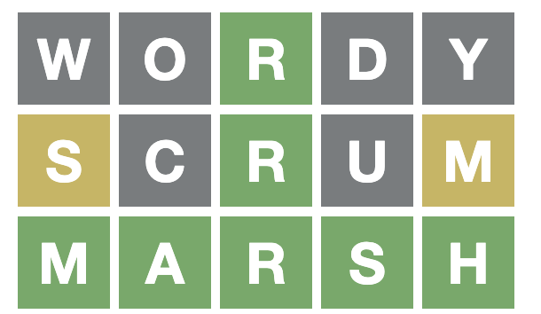

# mongordle

Using MongoDB's Atlas with a collection of all of Wordle's possible answers, usefully indexed, the `word_guesser.rb` script provides possible solutions given word guesses and Wordle's response hints.

To use this tool, first import `words.json` into MongoDB Atlas:

    mongoimport --uri "mongodb+srv://$ATLAS_USER:$ATLAS_PWD@$ATLAS_HOST/wordle" --collection words --file words.json --jsonArray --drop

Then, as you play [Wordle](https://www.nytimes.com/games/wordle/index.html), run `word_guesser.rb` providing each guessed word and the returned hints pattern.  Like this:

    $ ruby word_guesser.rb "WORDY xx^xx"              
    {"letters":{"$nin":["W","O","D","Y"],"$all":["R"]},"letter3":{"$eq":"R"}}
    AGREE
    BARGE
    .
    .
    .
    VERGE
    VERVE
    VIRAL
    VIRUS
    73

The output consists first of the constraints used on the `.find()` call to Atlas, for insight into how the guesses and associated match patterns are used to filter to the remaining possible solutions.  Following the constraint criteria is a list of all possible solutions remaining, followed by the count of them.

The `word_guesser.rb` command-line syntax consists of up to 6 `"<word guess> <pattern match to solution>"` parameters.  The match pattern must be 5 characters consisting of and positionally in sync with the associated word guess:

* `x`: the letter is not in the solution in this position, and perhaps not anywhere in the solution (Wordle's grey box)
* `~`: the letter is in the solution, but not in this position (Wordle's yellow box)
* `^`: the letter is correct, in this position (Wordle's green box)

Continuing with the above example, picking one of the words returned:

    $ ruby word_guesser.rb "WORDY xx^xx" "SCRUM ~x^x~"
    {"letters":{"$nin":["W","O","D","Y","C","U"],"$all":["R","S","M"]},"letter1":{"$nin":["S"]},"letter3":{"$eq":"R"},"letter5":{"$nin":["M"]}}
    MARSH
    1

Voila, a win in three tries!

